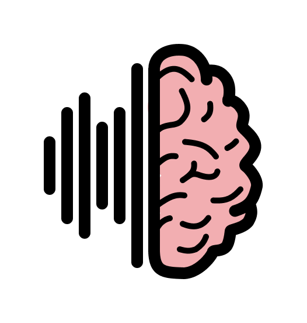
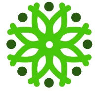
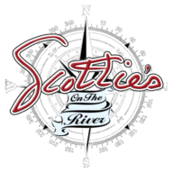
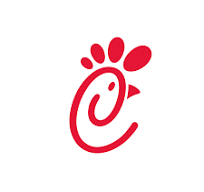

hi 👋
i'm mason yarbrough, 19, chattanooga -> soon sf

some cool things about me: 
 - im the founder of kallro, a platform for ai phone agents tailored to smbs
 - previously, i built golocal, a local-experience marketplace that used ai to scrape local businesses websites to surface everything happeneing in the city. 
 - i dropped out of the university of tennesse at chattanooga, where i was on track for a dual degree in computer science and physics.
- i love the internet and think its the greatest invention since fire

beyond all that i am a designer, hobby photographer, and sometimes i write 

connect with me:  |  | 
email: mason@kallro.com | masony817@gmail.com
need to call? lets do it here 

some things i believe:
 - the purpose of humans is to live synchronously with animals, plants, and technology.
 - knowledge abstracted and in abundance is the greatest achievement that we can accomplish as a society. for everyone no if, ands, or buts.
- dopamine is the life blood of humans, and where you get it from shapes how you live.
- ai is meant to be a tool to supercharge knowledge work, not replace your own thinking
- you can do anything; its your right as a human to shape the world
- love is the most important thing - love who you live with, what you do, and why you do it.

cv:
 -  founder, kallro
-  product engineer, buynothing
-  founding engineer, adscratch - died
-  founder, golocal/circliq - died
-  utc student
-  server, scotties on the river
-  barista, culture coffee
-  shift manager, chickfila
- lots of other small resturant gigs trying to pay my bills 